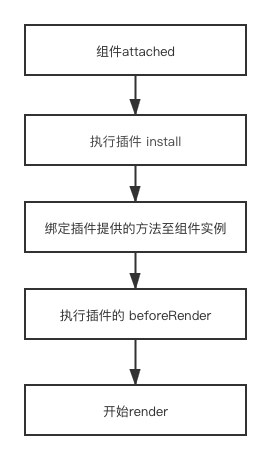

基于一系列原因，有了小历同学2.0的重构版本，该版本使用了插件系统，使得项目更轻量，结构更清晰，开发及维护成本大大降低。

::: tip 提示 👇
此插件系统未考虑异步数据流及执行优先级的情况
:::

## 运行机制

插件采用了管道的思想，数据会流经各个插件，经过一系列插件处理后见需要渲染的数据交还给 `render` 函数，由 `render` 函数负责渲染。



## 插件结构

拿简单的农历插件来说，该插件其实要满足的就是对于日期农历的计算。

``` js
import { renderCalendar } from '../../render'
import convertSolarLunar from './convertSolarLunar'

export default () => {
  return {
    name: 'convertSolarLunar',
    /**
     * beforeRender 可在日历渲染前做 calendarData 数据的处理操作
     * calendarData 由上一个插件处理后的数据
     * calendarConfig 组件配置
     * component 当前组件实例
     * @return calendarData
     **/
    beforeRender(calendarData, calendarConfig, component) {
      // do some thing
      const some_data = {}
      const some_config = {}
      // 此处须返回处理后的数据，否则下一个插件不能接收到数据导致不能运行
      // 无需做数据处理则不需要定义该方法，或者直接返回上游的 calendarData, calendarConfig
      return {
        calendarData: {
          ...some_data,
          ...calendarData
        },
        calendarConfig: {
          ...some_config,
          ...calendarConfig
        }
      }
    },
    /**
     * 点击日期时可在日历渲染前根据所选日期做自有的处理
     * tapeDate 当前点击的日期
     * calendarData 由上一个插件处理后的数据
     * calendarConfig 组件配置
     * @return calendarData
     **/
    onTapDate(tapeDate, calendarData = {}, calendarConfig = {}) {
      // do some thing

      // 此处须返回处理后的数据，否则下一个插件不能接收到数据导致不能运行
      // 无需做数据处理则不需要复写方法，或者直接返回上游的 calendarData, calendarConfig
      return {
        ...calendarData,
        ...calendarConfig
      }
    },
    /**
     * 需要挂载到组件实例上的方法
     **/
    methods(component) {
      return {
        convertSolarLunar: (dataInfo = {}) => {
          const { year, month, date } = dataInfo
          return convertSolarLunar.solar2lunar(year, month, date)
        },
        // 调用 renderCalendar 示例
        other: () => {
          // 当调用该方法时，做一些处理，比如组件数据处理
          const calendarData = {}
          // 数据处理完毕后交由 renderCalender 处理，注意此处需要使用call将当前组件的实例绑定到 renderCalendar 上
          // 此处调用 renderCalendar 后会经由一系列插件（包括此插件）的 beforeRender 处理
          renderCalendar.call(component, calendarData, [config])
        }
      }
    }
  }
}
```

至此一个简单的插件已经开发完成。

相较于 `1.x` 版本无论是否需要农历功能，都需要附带一个比较大的农历计算 `js` 库，采用插件形式则可以将不需要的功能给去除。

对于小程序有代码大小包的限制来说寸土寸金，对比仅需展示简单功能的而言，`2.0` 比 `1.x` 版本体积减少达 70%。